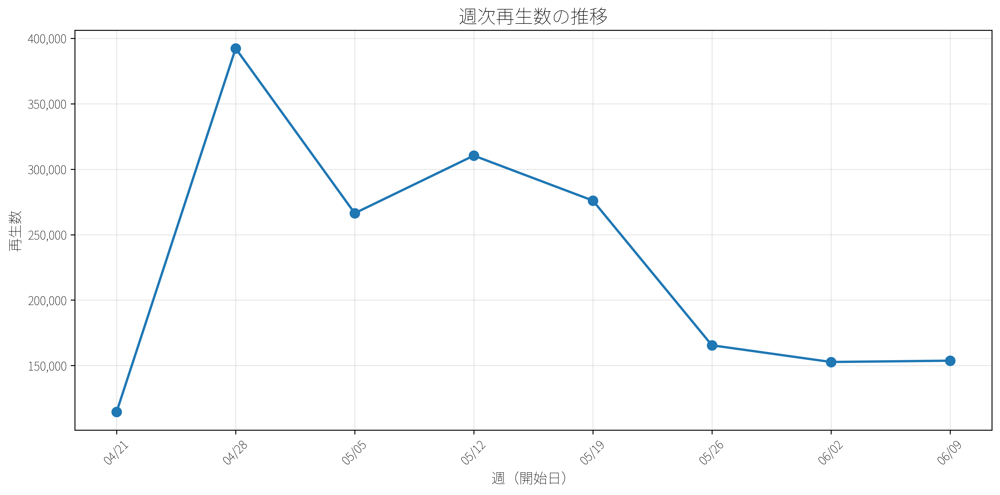
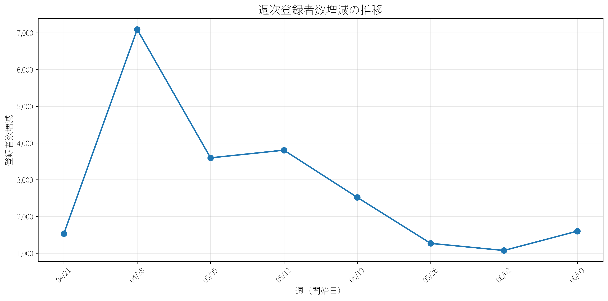

# YouTubeチャンネル レポート

**生成日時:** 2025年06月19日 20:44

---

## 1. 概要

### ＜累計＞
| 指標名 | 現状 |
|:---|:---|
| チャンネル登録者数 | 87,700人 |
| 総再生数 | 5,428,946回 |

### ＜週次ごと実績＞
| 指標名 | 今週 | 前週 | 増減 |
|:---|:---:|:---:|:---:|
| チャンネル登録者数 | 1,352 | 916 | +436 |
| 総再生数（週次） | 130,659 | 113,600 | +17,059 |

## 2. 動画ごと (直近14日間)

| 投稿日 | タイトル | URL | 種類 | 再生数 | 平均視聴時間 | 登録者増 | 登録者減 | 登録者純増 |
|:---|:---|:---|:---:|:---:|:---:|:---:|:---:|:---:|
| 06/16 | 【チームみらい】仙台街宣！あなたの街へ伺います #チームみらい #安野たかひろ ... | [リンク](https://www.youtube.com/watch?v=rDTFiUA_NsA) | ショート | 3,685 | 26秒 | 0 | 0 | 0 |
| 06/16 | 【記者会見】「チームみらい」神奈川県選挙区 参議院選挙 公認候補者予定者発表！ | [リンク](https://www.youtube.com/watch?v=zE3GxHdIl-4) | 通常 | 3,153 | 143秒 | 4 | 4 | 0 |
| 06/15 | 【週刊チームみらいLIVE】大阪より生配信！　チームみらい公式キャラクター決定！... | [リンク](https://www.youtube.com/watch?v=8b7Wcs6ufhA) | 通常 | 6,049 | 542秒 | 18 | 10 | +8 |
| 06/15 | 【チームみらいLIVE】街頭演説＠大阪梅田 | [リンク](https://www.youtube.com/watch?v=K4qQrlUNotc) | 通常 | 5,845 | 331秒 | 25 | 1 | +24 |
| 06/14 | 【米価格高騰&IT】コメ騒動を起こしている理由は？　作況指数は平年並みなのに価格... | [リンク](https://www.youtube.com/watch?v=J_F3Pgaq9RY) | 通常 | 30,981 | 249秒 | 446 | 8 | +438 |
| 06/13 | 【チームみらい】名古屋のリアルを感じに！ #shorts #チームみらい #安野... | [リンク](https://www.youtube.com/watch?v=4EsmXS1e6FE) | ショート | 9,667 | 23秒 | 2 | 0 | +2 |
| 06/13 | オードリー・タン氏に学べ！　台湾のデジタル民主主義。　どこまでできてる？　実際ど... | [リンク](https://www.youtube.com/watch?v=kFX7DgijJ2g) | 通常 | 8,456 | 292秒 | 60 | 4 | +56 |
| 06/12 | 【チームみらいLIVE】みねしま侑也と河合みちおと教育/経済政策について喋る配信 | [リンク](https://www.youtube.com/watch?v=866aKUyCIzU) | 通常 | 7,977 | 550秒 | 19 | 7 | +12 |
| 06/11 | 【チームみらい】３つの「終わらせる」【公認候補予定者・街頭演説】 | [リンク](https://www.youtube.com/watch?v=F8X5cQ_cNuE) | 通常 | 6,947 | 298秒 | 28 | 7 | +21 |
| 06/10 | 【政策解説】実は世界で一番画一的だった日本の教育 / 子どもの志向、特性に合わせ... | [リンク](https://www.youtube.com/watch?v=sNOJTjbozUQ) | 通常 | 13,645 | 239秒 | 87 | 7 | +80 |
| 06/09 | 【子育ての壁】面倒な手続き、どうしたらいい？【チームみらい政策】 | [リンク](https://www.youtube.com/watch?v=VJXGsB2fiNw) | 通常 | 3,378 | 257秒 | 7 | 10 | -3 |
| 06/08 | 【週刊チームみらいLIVE】生配信！ | [リンク](https://www.youtube.com/watch?v=7whJUFCc0_o) | 通常 | 7,650 | 451秒 | 16 | 9 | +7 |
| 06/07 | 【SNS上の偽情報を検知】AIファクトチェッカーをリリースしました【チームみらい... | [リンク](https://www.youtube.com/watch?v=z4r3UrVcTeY) | 通常 | 9,402 | 206秒 | 54 | 3 | +51 |
| 06/06 | 【選挙戦略】マシュマロ質問、ぜんぶ答えます／後編【テック外交】 | [リンク](https://www.youtube.com/watch?v=byboktGsllA) | 通常 | 7,756 | 352秒 | 15 | 7 | +8 |
| 06/05 | 【チームみらい】千葉県選挙区 参議院選挙 公認候補予定者発表【記者会見】 | [リンク](https://www.youtube.com/watch?v=lxhU56WrZVg) | 通常 | 4,807 | 182秒 | 5 | 2 | +3 |

## 3. グラフ

### 週次再生数の推移

### 週次登録者数の推移

## 4. 注意事項

- このレポートはYouTube Analytics APIから取得したデータに基づいています。
- サムネイルのインプレッション数やインプレッション率は、YouTube Studioでのみ確認可能なため、このレポートには含まれていません。
- 一部の指標は、YouTubeの仕様により取得できない場合があります。
- データは生成時点での最新情報です。

---
*レポート生成日時: 2025年06月19日 20:44*
